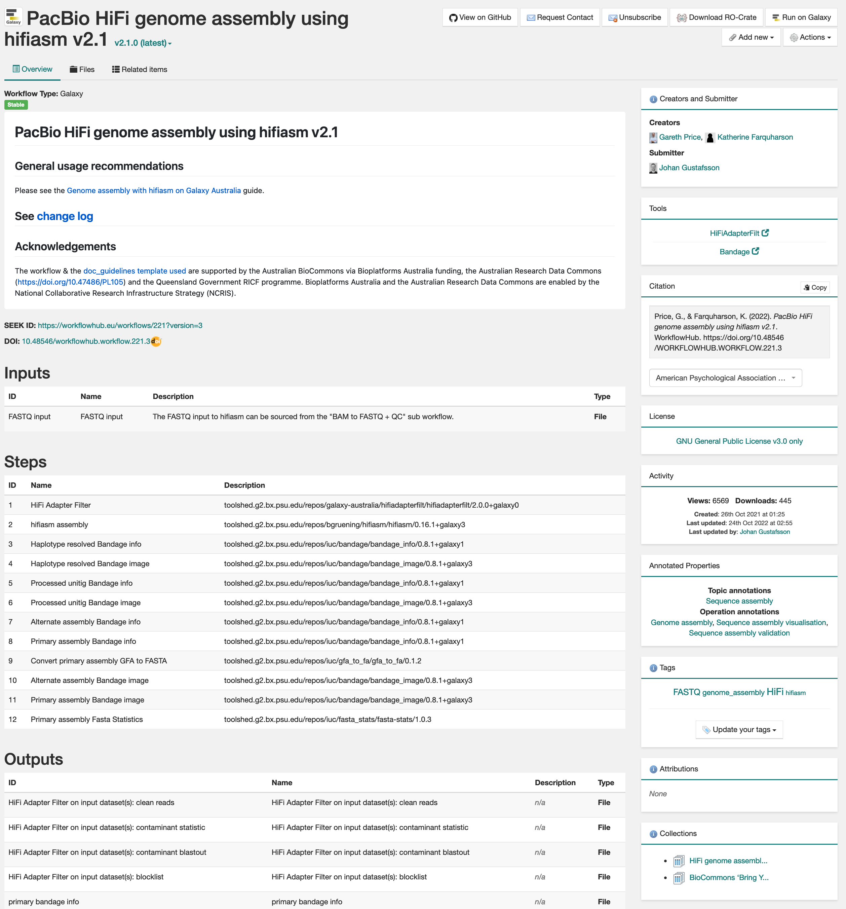
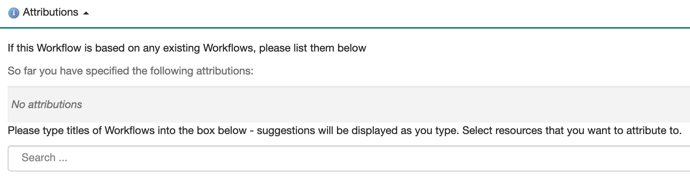



## Quick start guide

1. [Create a workflow!](#1-create-a-workflow) 
2. [Improve the workflow (i.e. version control, license, documentation)](#2-improve-the-workflow)
3. [Register or Log-in to WorkflowHub](#3-are-you-a-new-workflowhub-user)
4. [Join a team, or create a new Team](#4-join-a-team-or-create-a-new-team)
5. [Register your workflow](#5-registering-the-workflow)
6. [Add minimum metadata](#6-add-minimum-metadata)
7. [Add attributions for other workflows](#7-add-attributions-for-other-workflows)
8. [Create a DOI](#8-create-a-doi)
9. [Add workflow How-to Guide metadata](#9-add-workflow-how-to-guide-metadata)
10. Done. Thank you for contributing!

### Example

An example workflow that follows the guidelines described:
> Price, G., & Farquharson, K. (2022). PacBio HiFi genome assembly using hifiasm v2.1. WorkflowHub. [https://doi.org/10.48546/WORKFLOWHUB.WORKFLOW.221.3](https://doi.org/10.48546/WORKFLOWHUB.WORKFLOW.221.3)

### Things to note

- All workflows in the Australian BioCommons WorkflowHub space will automatically appear in the [WorkflowFinder service](https://australianbiocommons.github.io/2_1_workflows.html) as well.
- A minimum set of metadata is expected for workflows registered in the BioCommons WorkflowHub space. These are described in more detail in the [add minimum metadata section](#6-add-minimum-metadata).

## More in-depth guide

### 1. Create a workflow



### 2. Improve the workflow

#### 2.1 Version control the workflow with git

Add your workflow to a Git enabled repository (e.g. [GitHub](https://github.com/)). This allows easy import into WorkflowHub, and in particular the import of new workflow versions!

#### 2.2 License the workflow for reuse

Make sure to add a license that allows others to reuse your workflow. This resource can help you choose a license: https://choosealicense.com/

If you are still unsure which open source license to pick, the standard for the Australian BioCommons is [Apache 2.0](https://spdx.org/licenses/Apache-2.0.html).

#### 2.3 Document the workflow well

Update documentation so new users can understand what the workflow does, how it does this, and why. There are multiple options for how to document a workflow and include this in WorkflowHub: 

- 
- 
- 
- .

#### 2.4 Add standard files (optional but recommended)

Consider adding a machine-readable standard file format like `CITATION.cff` or `codemeta.json` to your  workflow repository (e.g. GitHub, or similar). There are wizards for creating these files, so you don't need to know how to build them yourself.

-  --- [Wizard link](https://codemeta.github.io/codemeta-generator/) 
-  --- [Wizard link](https://citation-file-format.github.io/cff-initializer-javascript/#/)

#### 2.5 Create a workflow release

Follow the [instructions on GitHub](https://docs.github.com/en/repositories/releasing-projects-on-github/about-releases) to create a workflow release and tag.

#### 2.6 Now that the hard part is completed, [proceed to WorkflowHub!](https://workflowhub.eu/)



### 3. Are you a new WorkflowHub user?

- **Yes:** [Register with WorkflowHub](https://workflowhub.eu/signup). Make sure to add your organisation(s) / affiliation(s).
- **No:** [Login to WorkflowHub](https://workflowhub.eu/login)

### 4. Join a team, or create a new Team

Is there a Team available to join? Below are the current options in the BioCommons space. If any of these Teams are suitable, click the link below to request membership:

-  - [`Request to join`](https://workflowhub.eu/projects/54/guided_join)
-  - [`Request to join`](https://workflowhub.eu/projects/43/guided_join)
-  - [`Request to join`](https://workflowhub.eu/projects/42/guided_join)
-  - [`Request to join`](https://workflowhub.eu/projects/41/guided_join)
-  - [`Request to join`](https://workflowhub.eu/projects/48/guided_join)

If there is no suitable Team, you can [**create a new one here**](https://workflowhub.eu/projects/guided_create). Make sure you select the `Australian BioCommons` Space.

### 5. Registering the workflow

Follow the instructions available in the WorkflowHub documentation to:

1. [**Import a Git repository**](https://about.workflowhub.eu/docs/adding-files/#git), and
2. [**Complete workflow metadata**](https://about.workflowhub.eu/docs/complete-workflow-metadata/)

### 6. Add minimum metadata

The minimum metadata expected for a workflow:

| Field                      | Description|
|----------------------------|--------------------------------------------------------------------|
| Workflow title             | Make sure the title is descriptive and highlights what the workflow does.|
| Creator(s)               | If you have included a `CITATION.cff` file in your GitHub repository, WorkflowHub can parse this and automatically populate the creator field. |
| Description              | Note that descriptions included in GitHub repository README files will be automatically parsed by WorkflowHub. |
| Maturity                 | Indicate if the workflow is `mature` or a `work-in-progress`. |
| License                    | Note that if a license file is included in your GitHub repository it will be automatically parsed by WorkflowHub. |
| EDAM Topics and Operations | Add concepts from [EDAM](https://github.com/edamontology/edamontology) as standardised short descriptions of workflow domain, purpose, and function. You can search for EDAM terms within the WorkflowHub workflow registration wizard. You can also use [EDAM browser](https://edamontology.github.io/edam-browser/) to explore and search the EDAM ontology for appropriate concepts. |

### 7. Add attributions for other workflows

If the workflow you are registering is based on another workflow that is also registered in WorkflowHub, you can add this workflow to the `Attribution` metadata field during registration (see below).

### 8. Create a DOI

You can mint a [digital object identifier (DOI)](https://www.doi.org/) for your workflow using WorkflowHub. This allows you to create a *persistent* link to specific versions of your workflow and to also generate a citation for your workflow.

Follow the instructions available in the WorkflowHub documentation to [**mint a DOI**](https://about.workflowhub.eu/docs/citable/).

### 9. Add workflow How-to Guide metadata

### 10. Done, Thank you for contributing!

